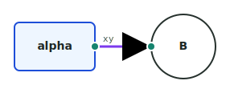
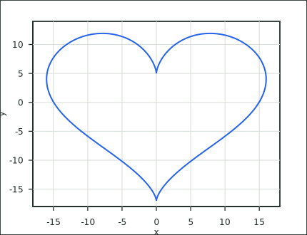
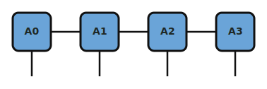

# GraphSX

GraphSX is a JSX-like DSL for drawing diagrams, plots, and Markdown-native figures as SVG.

It is designed for notes, papers, docs, and small scientific figures where the source should stay readable:

- JSX-like tags and props instead of a separate command language
- reusable shapes with public ports
- links, explicit paths, routing, arrowheads, and labels
- standalone plots with axes, data, ticks, legends, annotations, and KaTeX labels
- nested plots inside graphs for subplots and mixed plot/diagram figures
- Markdown fences and CodeMirror live-preview widgets

Try the playground: https://slxuphys.github.io/graphsx/

Current npm package name: `@slxu/graphsx`. Project and repo name: GraphSX.

Install from npm:

```bash
npm install @slxu/graphsx
```

Optional integrations use the host app's packages:

```bash
npm install katex markdown-it
npm install codemirror @codemirror/state @codemirror/view @codemirror/lang-javascript @codemirror/lang-markdown
```

## What It Looks Like

### Port Diagram

```jsx
<Graph>
  <Style id="box" fill="#eef6ff" stroke="#1d4ed8" />
  <Style id="wire" stroke="#7c3aed" strokeWidth={3} />

  <Rect id="A" at={[70, 82]} size={[100, 60]} label="alpha" useStyle="box">
    <Port id="out" right label="xy" />
  </Rect>
  <Circle id="B" at={[280, 112]} r={40} label="B">
    <Port id="in" left />
  </Circle>

  <Link headArrow from="A.out" to="B.in" useStyle="wire" />
</Graph>
```



### Parametric Plot

```jsx
<Plot width={430} height={330} xDomain={[-18, 18]} yDomain={[-18, 14]} frame box>
  <Data
    id="heart"
    x="16 * pow(sin(t), 3)"
    y="13*cos(t) - 5*cos(2*t) - 2*cos(3*t) - cos(4*t)"
    domain={[0, 2*pi]}
    samples={360}
  />

  <Axis x label="x" ticks grid />
  <Axis y label="y" ticks grid />
  <Line data="heart" stroke="#e11d48" strokeWidth={2.6} />
</Plot>
```



### Reusable Shapes And Repeat

```jsx
<Graph route="straight">
  <Shape id="Tensor" groupBox={false}>
    <Rect id="box" size={[54, 54]} corner={8} label={tensorLabel}>
      <Port id="left" left r={0} />
      <Port id="right" right r={0} />
      <Port id="phys" bottom r={0} />
    </Rect>
    <Port id="left" target="box.left" />
    <Port id="right" target="box.right" />
    <Port id="phys" target="box.phys" />
  </Shape>

  <Repeat count={4} as="i" step={[96, 0]}>
    <Tensor id={`A${i}`} at={[70, 60]} tensorLabel={`A${i}`} />
  </Repeat>
</Graph>
```



## Quick Example

```jsx
<Graph>
  <Style id="box" fill="#eef6ff" stroke="#1d4ed8" strokeWidth={2} />
  <Style id="wire" stroke="#7c3aed" strokeWidth={3} />

  <Rect id="A" at={[100, 100]} size={[100, 60]} label="$\alpha$" useStyle="box">
    <Port id="out" right label="xy" />
  </Rect>

  <Circle id="B" at={[300, 100]} r={40} label="B">
    <Port id="in" left />
  </Circle>

  <Link headArrow from="A.out" to="B.in" useStyle="wire" />
</Graph>
```

Use it from JavaScript:

```js
import { parseGraphSXDocument, renderGraphSXDocument } from "@slxu/graphsx";
import katex from "katex";

const model = parseGraphSXDocument(source);
renderGraphSXDocument(document.querySelector("svg"), model, { katex });
```

Labels are opt-in. Use `label="xy"` for plain text and `label="$\alpha$"` for KaTeX math. If there is no `label` prop, no label is rendered.

## Syntax Model

GraphSX should feel familiar if you already understand JSX:

- tags define components: `<Rect />`, `<Plot />`, `<Shape />`
- props configure components: `at={[100, 80]}`, `label="$x$"`, `frame`
- children nest inside parents: ports inside shapes, ticks inside axes
- braces hold static values and simple arithmetic: `{[L / 2, 20]}`
- backtick strings support substitution: ``label={`$A^{[${site}]}$`}``

GraphSX is not a full JSX compiler. Values are parsed by a small safe parser, not by executing arbitrary JavaScript.

## Styling

Most visible components can be styled inline:

```jsx
<Rect id="A" style={{ fill: "#eef6ff", stroke: "#1d4ed8", strokeWidth: 2 }} />
<Link from="A.right" to="B.left" style={{ stroke: "#7c3aed", strokeWidth: 3 }} />
```

Or with reusable style libraries:

```jsx
<Graph>
  <Style id="tensor" fill="#6aa4d8" stroke="#111111" strokeWidth={3} />
  <Style id="wire" stroke="#111111" strokeWidth={2.5} />

  <Rect id="A" useStyle="tensor" />
  <Link from="A.right" to="B.left" useStyle="wire" />
</Graph>
```

Inline `style` overrides `useStyle`. Style keys can use camelCase, such as `strokeWidth`; the renderer maps them to SVG attributes.

Plot-specific boxes also support dedicated style props, such as `frameStyle`, `boxStyle`, `textStyle`, and `labelStyle`.

## Graphs

`<Graph>` is the general figure canvas. It auto-sizes around its content and supports nodes, ports, links, paths, reusable shapes, repeats, and nested plots.

Canonical built-in graph nodes:

- `Rect`
- `Circle`
- `Point`, `Anchor`
- `Plot` when placed inside a graph

`Rect`, `Circle`, and nested `Plot` expose default ports:

```txt
A.left
A.right
A.top
A.bottom
```

`Point` and `Anchor` expose:

```txt
J.center
```

### Ports

Ports can use side shorthand or custom local coordinates:

```jsx
<Rect id="A" at={[100, 100]} size={[120, 80]}>
  <Port id="in" left />
  <Port id="tap" at={[60, 20]} angle={35} label="$t$" />
</Rect>
```

`at` on a port is relative to its shape. `angle` controls the direction a routed link emits from or enters the port. `0` points right, `90` points down, `180` points left, and `-90` points up.

### Links

Links connect quoted port addresses:

```jsx
<Link headArrow from="A.right" to="B.left" />
```

Routing options:

```jsx
<Graph route="auto" grid={20} padding={16} corner={8}>
  <Rect id="A" at={[60, 100]} size={[90, 60]} />
  <Rect id="Block" at={[210, 70]} size={[90, 110]} />
  <Rect id="B" at={[380, 100]} size={[90, 60]} />

  <Link headArrow from="A.right" to="B.left" />
  <Link headArrow from="A.top" to="B.top" route="orthogonal" corner={0} />
</Graph>
```

Available routes:

- default curved route
- `route="straight"`
- `route="orthogonal"`
- `route="auto"` for first-pass obstacle avoidance

`route="auto"` avoids shape boxes. It does not yet optimize for edge crossings.

### Paths

Use `<Path>` for exact geometry rather than semantic port-to-port links:

```jsx
<Graph>
  <Path points={[[90, 80], [90, 240], [180, 240]]} />
  <Path points={[[120, 80], [170, 80], [170, 160]]} corner={6} headArrow />
  <Path d="M 90 80 L 180 80" tailArrow arrowSize={8} />
</Graph>
```

`Path` accepts `points` or raw SVG `d`. Add `headArrow`, `tailArrow`, and `arrowSize` for arrows. `corner` rounds bends in point paths.

### Layout

Coordinates are optional when graph layout is enabled:

```jsx
<Graph layout="dag" direction="right" rankGap={200} nodeGap={90}>
  <Rect id="A" size={[100, 60]} />
  <Rect id="B" size={[100, 60]} />
  <Rect id="C" size={[100, 60]} />

  <Link headArrow from="A.right" to="B.left" />
  <Link headArrow from="A.right" to="C.left" />
</Graph>
```

Supported layouts:

- `layout="row"`
- `layout="column"`
- `layout="dag"`

Explicit `at={[x, y]}` positions win over automatic layout.

## Reusable Shapes

Define custom shapes with `<Shape>`, then instantiate them by tag name:

```jsx
<Graph>
  <Shape id="Tensor" groupBox={false}>
    <Rect id="box" at={[0, 0]} size={[56, 56]} corner={8} label={`$A^{[${site}]}$`} />
    <Port id="left" target="box.left" />
    <Port id="right" target="box.right" />
    <Port id="phys" target="box.bottom" />
  </Shape>

  <Repeat count={4} as="i" step={[100, 0]}>
    <Tensor id={`A${i}`} at={[100, 100]} site={i} />
  </Repeat>

  <Repeat count={3} as="i">
    <Link from={`A${i}.right`} to={`A${i+1}.left`} />
  </Repeat>
</Graph>
```

Address paths use ids. `A0.left` is the public port on the `Tensor` instance. `A0.box.left` is the `left` port on the internal child rectangle.

Grouped shapes render a dashed group box by default. Use `groupBox={false}` on the shape definition or on an instance to hide it.

Shape variants can inherit from another shape:

```jsx
<Shape id="Gate" groupBox={false}>
  <Rect id="box" size={[70, 40]} label={label} />
  <Port id="in" target="box.left" />
  <Port id="out" target="box.right" />
</Shape>

<Shape id="WideGate" from="Gate" w={110} label="$U$" />
```

Derived shapes can override props, but not replace inherited children with the same id.

## Repeat

Use `<Repeat>` to expand repeated nodes, links, paths, or shape internals:

```jsx
<Graph>
  <Repeat count={2} as="row" step={[0, 90]}>
    <Repeat count={3} as="col" step={[100, 0]}>
      <Rect id={`cell-${row}-${col}`} at={[100, 100]} size={[70, 50]} label={`cell ${row},${col}`} />
    </Repeat>
  </Repeat>
</Graph>
```

`step` offsets each repeated copy. Backtick strings can use `${i}`, `${i+1}`, `${row}`, `${col}`, and simple arithmetic.

## Plots

`<Plot>` can be used standalone:

```jsx
<Plot width={560} height={340} xDomain={[0, 2*pi]} yDomain={[-1.2, 1.2]} frame box>
  <Data id="sin" y="sin(x)" domain={[0, 2*pi]} samples={160} />

  <Axis x label="$x$">
    <Ticks
      values={[0, pi/2, pi, 3*pi/2, 2*pi]}
      labels={["$0$", "$\pi/2$", "$\pi$", "$3\pi/2$", "$2\pi$"]}
      grid
    />
  </Axis>
  <Axis y label="$\sin(x)$" ticks grid />

  <Line data="sin" stroke="#2563eb" strokeWidth={2} label="$\sin(x)$" />
  <Legend />
</Plot>
```

Or inside a graph as a placed subplot:

```jsx
<Graph>
  <Plot id="left" at={[0, 0]} width={320} height={220} frame box>
    <Port id="out" right />
    <Axis x ticks />
    <Axis y ticks />
    <Line points={[[0, 1], [1, 2], [2, 4]]} />
  </Plot>

  <Plot id="right" at={left.right + [90, 0]} width={320} height={220} frame box>
    <Port id="in" left />
    <Axis x ticks />
    <Axis y ticks />
    <Line points={[[0, 4], [1, 2], [2, 1]]} />
  </Plot>

  <Link from="left.out" to="right.in" headArrow />
</Graph>
```

In a plot:

- `frame` draws the outer plot panel
- `box` draws the inner axis/data box
- `padding` controls the gap between frame and axes
- `xDomain` and `yDomain` set data coordinates
- `Data` can hold points, x/y arrays, or generated math data
- generated `Data` always stores point fields named `x` and `y`
- parametric data uses `x="..."` and `y="..."`; the default sampling variable is `t`
- `Line`, `Curve`, `Mark`, `Scatter`, `Text`, `Legend`, and annotation shapes render on top
- generated data expressions may be complex; plotted coordinates use the real part by default

Parametric curves sample a variable and evaluate both coordinates:

```jsx
<Plot width={500} height={460} xDomain={[-18, 18]} yDomain={[-18, 14]} frame box>
  <Data
    id="heart"
    x="16 * pow(sin(t), 3)"
    y="13*cos(t) - 5*cos(2*t) - 2*cos(3*t) - cos(4*t)"
    domain={[0, 2*pi]}
    samples={420}
  />
  <Line data="heart" stroke="#e11d48" strokeWidth={2.8} />
</Plot>
```

For `y="..."` alone, the default sampling variable is `x`, and the sampled domain value is stored as the point's `x` field. For `x="..."` plus `y="..."`, the default sampling variable is `t`; both expressions are evaluated from that variable and stored as point fields named `x` and `y`. Use `variable="theta"` to override either default.

```jsx
<Data id="phase" y="exp(1j*t)" variable="t" domain={[0, 2*pi]} />
```

This stores points like `{ x: t, y: exp(1j*t) }`.

Complex math uses Python-style imaginary literals such as `1j`, `2.5j`, and `x + 3j`. Bare `j` is just a normal variable name, so `exp(j*x)` only works if `j` is declared in `params`.

```jsx
<Plot width={560} height={340} xDomain={[-1, 1]} yDomain={[-1.1, 1.1]} frame box>
  <Data id="root" y="sqrt(x)" domain={[-1, 1]} samples={200} />

  <Axis x label="$x$" ticks grid />
  <Axis y label="$\sqrt{x}$" ticks grid />

  <Line data="root" label="real" />
  <Line data="root" yMap="imag(y)" stroke="#dc2626" label="imag" />
  <Line data="root" yMap="abs(y)" stroke="#16a34a" label="abs" />
  <Legend />
</Plot>
```

Use `xMap` and `yMap` to transform stored points at plot time. The map scope contains the stored `x` and `y` values, which may be real or complex. Either map can use either stored field:

```jsx
<Plot width={420} height={420} xDomain={[-1.2, 1.2]} yDomain={[-1.2, 1.2]} frame box>
  <Data id="phase" y="exp(1j*t)" variable="t" domain={[0, 2*pi]} samples={240} />

  <Line data="phase" xMap="real(y)" yMap="imag(y)" label="unit circle" />
</Plot>
```

Plot annotations can use `Rect`, `Circle`, `Anchor`, `Link`, and `Path`:

```jsx
<Plot width={500} height={300} xDomain={[0, 5]} yDomain={[0, 10]} frame box>
  <Line points={[[0, 1], [2, 4], [5, 9]]} />
  <Circle id="peak" at={[5, 9]} r={5} fill="#ef4444" />
  <Rect id="note" at={[3.2, 8.2]} size={[90, 28]} label="peak">
    <Port id="tip" left />
  </Rect>
  <Link from="note.tip" to="peak.top" headArrow />
</Plot>
```

Annotation coordinates default to data coordinates. Use `atUnit="screen"` for screen/SVG coordinates.

## Supported Tags

Common top-level tags:

| Tag | Children | Key props |
| --- | --- | --- |
| `Graph` | `Style`, `Shape`, nodes, `Plot`, `Link`, `Path`, `Repeat` | `route`, `layout`, `direction`, `grid`, `padding`, `corner` |
| `Plot` | plot children, and `Port` when nested in `Graph` | `width`, `height`, `padding`, `xDomain`, `yDomain`, `frame`, `box` |

Graph tags:

| Tag | Children | Key props |
| --- | --- | --- |
| `Rect` | `Port` | `id`, `at`, `size`, `w`, `h`, `label`, `corner`, `anchor`, `origin`, `rotate`, `flipX`, `flipY`, `style`, `useStyle` |
| `Circle` | `Port` | `id`, `at`, `r`, `label`, `anchor`, `origin`, `rotate`, `flipX`, `flipY`, `style`, `useStyle` |
| `Point`, `Anchor` | `Port` | `id`, `at`, `label`, `r`, `style`, `useStyle` |
| `Port`, `Leg` | none | `id`, `left`, `right`, `top`, `bottom`, `side`, `at`, `angle`, `target`, `label`, `r`, `style`, `useStyle` |
| `Link` | none | `from`, `to`, `route`, `corner`, `stub`, `headArrow`, `tailArrow`, `arrowSize`, `style`, `useStyle` |
| `Path` | none | `points`, `d`, `at`, `corner`, `closed`, `headArrow`, `tailArrow`, `arrowSize`, `rotate`, `flipX`, `flipY`, `style`, `useStyle` |
| `Shape` | graph nodes, `Port`, `Link`, `Path`, `Repeat` | `id`, `from`, `groupBox`, user-defined props |
| `Repeat` | repeatable graph children | `count`, `as`, `step` |
| `Style` | none | `id`, SVG style props |

Plot tags:

| Tag | Children | Key props |
| --- | --- | --- |
| `Data` | none | `id`, `points`, `x`, `y`, `domain`, `samples`, `params`, `variable` |
| `Axis` | `Ticks` | `x`, `y`, `label`, `ticks`, `grid`, `labelGap`, `tickLabelGap`, `tickSize`, `style`, `labelStyle` |
| `Ticks` | none | `values`, `labels`, `grid`, `labelGap`, `tickLabelGap`, `tickSize`, `style`, `labelStyle` |
| `Line`, `Curve` | none | `data`, `points`, `x`, `y`, `xMap`, `yMap`, `fmt`, `label`, `animate`, `stroke`, `strokeWidth`, `fill`, `r`, `style`, `useStyle` |
| `Mark`, `Scatter` | none | `data`, `at`, `points`, `x`, `y`, `xMap`, `yMap`, `r`, `label`, `animate`, `fill`, `stroke`, `style`, `useStyle` |
| `Text`, `Label` | none | `at`, `label`, `fontSize`, `anchor`, `baseline`, `rotate`, `style`, `useStyle` |
| `Legend` | none | `position`, `box`, `padding`, `margin`, `fontSize`, `textStyle`, `boxStyle` |

Canonical tags use PascalCase. A few aliases are accepted for convenience, but new examples should prefer the canonical form:

| Canonical | Aliases |
| --- | --- |
| `Rect` | `rect`, `Rec`, `rec` |
| `Circle` | `circle`, `Circ`, `circ` |
| `Point` | `point` |
| `Anchor` | `anchor` |
| `Path` | `path` |
| `Data` | `Dataset` |
| `Axis` | `XAxis`, `YAxis` |
| `Ticks` | `ticks` |
| `Curve` | `Series` |
| `Legend` | `legend` |

## Markdown

GraphSX works in Markdown with a `markdown-it` plugin:

```js
import MarkdownIt from "markdown-it";
import katex from "katex";
import { graphsxMarkdownIt, renderGraphSXBlocks } from "@slxu/graphsx";
import "@slxu/graphsx/markdown.css";

const md = new MarkdownIt().use(graphsxMarkdownIt);
const preview = document.querySelector("#preview");

preview.innerHTML = md.render(markdownSource);
renderGraphSXBlocks(preview, { katex });
```

Authors use `graphsx` fences:

````md
```graphsx
<Graph>
  <Rect id="A" />
  <Rect id="B" at={[220, 0]} />
  <Link headArrow from="A.right" to="B.left" />
</Graph>
```
````

Reusable style/shape libraries can be declared with hidden `graphsx-defs` fences:

````md
```graphsx-defs theme
<Style id="tensor" fill="#6aa4d8" stroke="#111111" />
<Style id="wire" stroke="#111111" strokeWidth={2.5} />
```

```graphsx use="theme"
<Graph>
  <Rect id="A" useStyle="tensor" />
  <Rect id="B" at={[120, 0]} useStyle="tensor" />
  <Link from="A.right" to="B.left" useStyle="wire" />
</Graph>
```
````

Multiple library names can be separated by spaces or commas.

## CodeMirror Live Preview

Use the CodeMirror extension to render `graphsx` fences as editable live widgets inside a Markdown editor:

```js
import { EditorView, basicSetup } from "codemirror";
import { markdown } from "@codemirror/lang-markdown";
import { jsxLanguage } from "@codemirror/lang-javascript";
import { graphsxCodeMirrorLivePreview } from "@slxu/graphsx/codemirror";
import "@slxu/graphsx/codemirror.css";

new EditorView({
  doc,
  extensions: [
    basicSetup,
    markdown({
      codeLanguages: (info) => {
        const name = info.trim().split(/\s+/)[0];
        return name === "graphsx" || name === "graphsx-defs" ? jsxLanguage : null;
      }
    }),
    graphsxCodeMirrorLivePreview({ katex })
  ],
  parent: document.querySelector("#editor")
});
```

When the cursor is outside a `graphsx` fence, the fence renders as an SVG widget. Clicking the widget moves the cursor into the original fenced code. `graphsx-defs` fences render as compact library markers and feed reusable shapes/styles to later fences.

## Development

```bash
npm install
npm test
npm run playground
```

The playground runs at the Vite URL printed in your terminal, usually `http://127.0.0.1:5173/`.

Build the GitHub Pages version:

```bash
npm run build:pages
```

## Notes

- Graph labels and plot labels support KaTeX when a `katex` instance is passed to the renderer.
- Graph `<Plot>` nodes behave like rectangles: they have `at`, `width`, `height`, and default side ports.
- Standalone `<Plot>` is best for one plot. Use `<Graph>` when you want subplots or a mixed figure.
- The parser intentionally supports a constrained JSX-like subset rather than arbitrary JavaScript.
